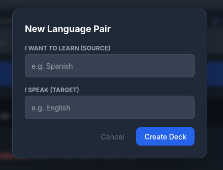
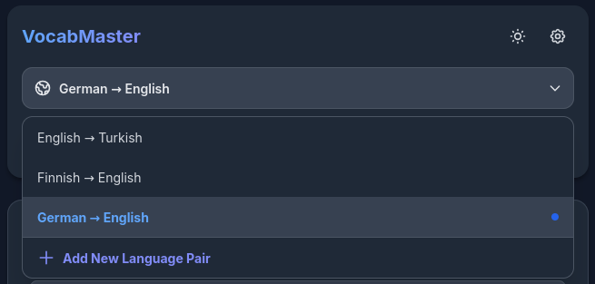
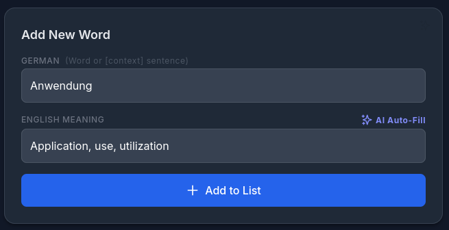
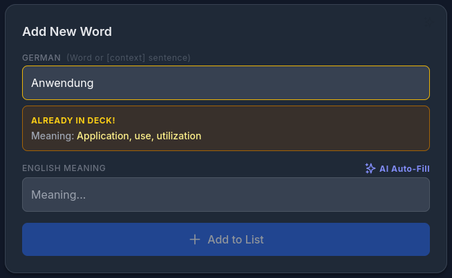
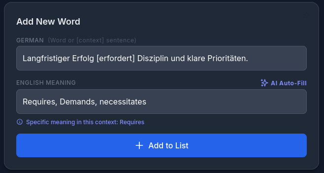
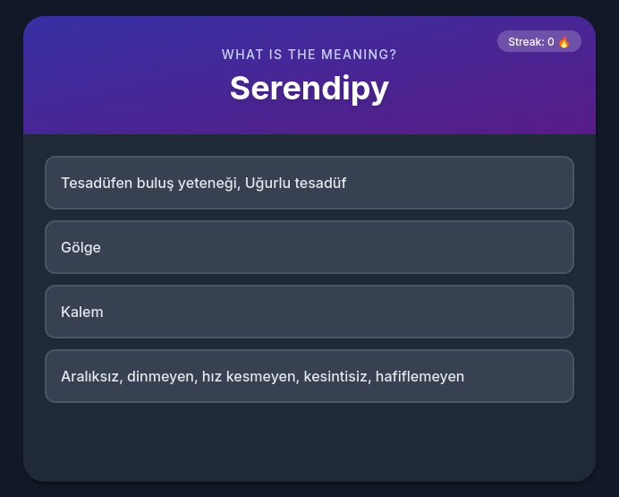
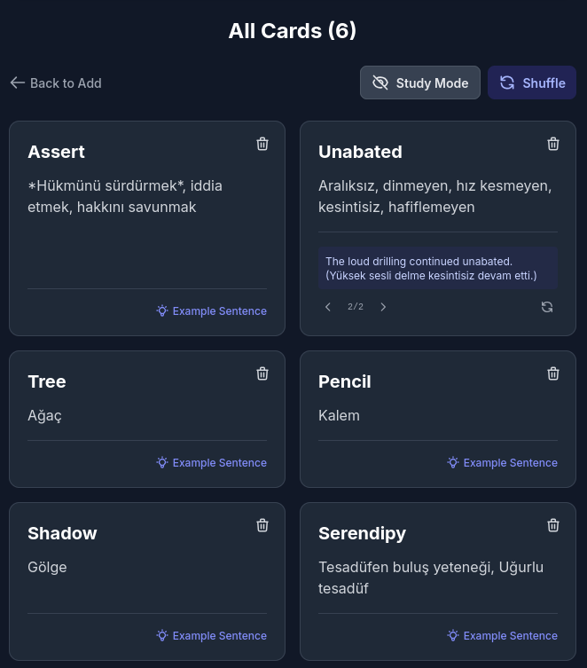
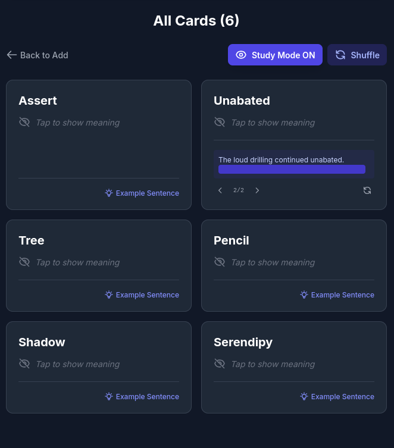
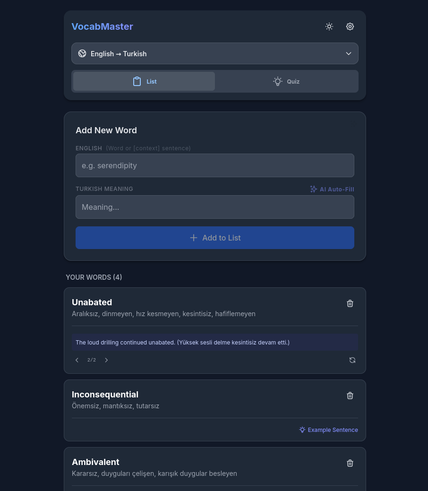

# VocabMaster AI

VocabMaster is a single-file web application designed to help users learn specific vocabulary they encounter while reading books or watching media. Unlike general-purpose flashcard applications, it is built to focus exclusively on words the user does not know, preserving the context in which they were found.

This project was built using Gemini 3 AI.

## Screenshots

### Multi-Language Support
*Create and switch between decks for different language pairs (e.g., English to Turkish).*

    
    

### Smart Word Entry
*Add new words easily. The system automatically checks for duplicates to prevent redundancy.*

    
    

### Context-Aware Learning
*Input a sentence to discover the specific meaning of a word within that context.*

    

### Quiz Mode
*Test yourself with auto-generated multiple-choice questions to reinforce learning.*

    

### Review & Study Mode
*View your collection in a grid layout or switch to "Study Mode" to hide meanings like flashcards.*

    
    

### General Overview
*This is how the web application looks*

    

## Core Functionality

The application addresses the issue of context-less vocabulary lists. Users can input a word within its original sentence (e.g., "It was a total [disaster]") to retrieve the specific meaning relevant to that context, rather than a generic dictionary definition.

## Features

* **Single-File Architecture:** The entire application runs from a single HTML file. No server or installation is required.
* **Context-Aware AI:** Uses the Gemini API to analyze words within sentences and provide context-specific translations.
* **Sentence Generation:** Generates example sentences for registered words to aid retention.
* **Quiz Mode:** Multiple-choice testing based on the user's personal list.
* **Study Mode:** A flashcard view that hides definitions and translations until clicked.
* **Multi-Language Support:** Users can create multiple decks for different language pairs (e.g., English -> Turkish, German -> English).
* **Data Management:** Data is stored in the browser's LocalStorage. Supports exporting and importing data via JSON files for backup.
* **Dark Mode:** Integrated dark theme support.

## Installation and Usage

1.  Download the `vocab_app.html` file.
2.  Open the file in any modern web browser (Chrome, Edge, Firefox, etc.).
3.  Click the Settings icon and enter a valid Google Gemini API Key.
4.  Create a deck and begin adding words.

## API Key Requirement

You can manually add your own translations without an API key. However, a valid API key is required for generating example sentences and retrieving detailed dictionary definitions via Google's Gemini models. Keys can be obtained from Google AI Studio.